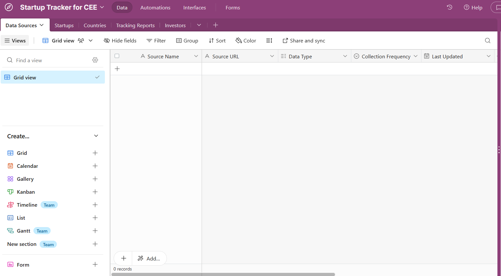
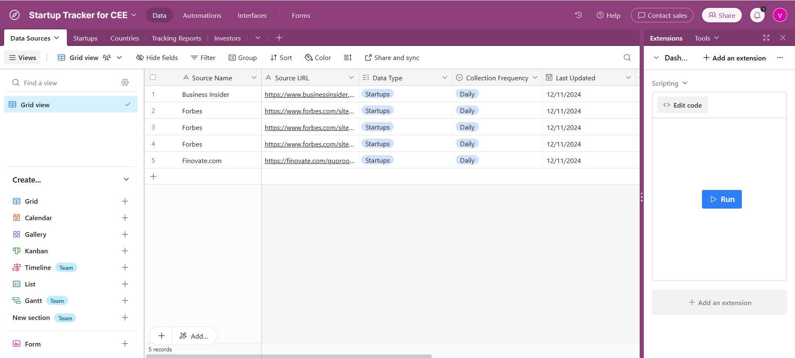

### Skript pro integraci kódu na skrapování informací s Airtable

Tento projekt slouží k přidávání a úpravy dat v Airtable pomocí API. Je třeba mít soubor scraped_data.json, podle struktury uvedené níže.

## Globální proměnné

AIRTABLE_API_KEY: API klíč pro přístup k Airtable

AIRTABLE_BASE_ID: Identifikátor Airtable databáze, kde budou data ukládána

TABLE_NAME: Název tabulky v Airtable, do které budou data přidávána

## Funkce

# add_row_to_airtable(row, table_name)

Přidá jeden řádek do zadané tabulky v Airtable

Parametry:

row: Slovník obsahující data, která mají být přidána do tabulky

table_name: Název tabulky, kam bude řádek přidán

Návratová hodnota: Vrací JSON odpověď z API požadavku s informacemi o přidaném záznamu nebo případné chybě

# add_scraped_data_to_airtable(scraped_data, table_name)

Iteruje přes zadaná data a přidává každý záznam do zadané tabulky v Airtable

Parametry:

scraped_data: Seznam slovníků obsahujících jednotlivé záznamy (řádky) s poli jako „Associated Countries“, „Collection Frequency“ atd.

table_name: Název tabulky, do které budou data přidána

# add_data_to_airtable()

Načítá data ze souboru scraped_data.json a předává je funkci add_scraped_data_to_airtable k přidání do Airtable

## Struktura scraped_data.json

Soubor scraped_data.json by měl obsahovat seznam objektů s následujícími klíči:

Associated Countries(List): seznam zemí, které souvisejí s obsahem zdroje

Collection Frequency(String): frekvence sběru dat ze zdroje

Data Type(List): typ dat

Last Updated(String): datum poslední aktualizace v airtable

Related Tracking Reports(list): související zprávy o sledování

Source Name(String): název zdroje

Source URL(String): URL zdroje

Startups(List): seznam startupů

## Jak spustit

python3 App.py

Počáteční stav aplikace:

Stav aplikace po běhu kodu:

Spustí se aplikace pro scrapování dat, která vezme z NewsAPI články, vytvoří JSON soubor scraped_data.json a zapíše zdroj článku a URL článku do Airtable.

python3 remove_all_data.py

Odstraní se všechny řádky z Airtable.

Další práce

cd for_future

python3 json_to_airtable.py

Spustí se aplikace, která vloží do Airtable informace z JSON souborů ve složce json_files. V případě, že u některého JSON elementu je zaznamenáno, že už v Airtable existuje, tak se změní pouze informace (nevytváří se nový řádek). Data musí být validní. Pro kontrolu:

cd validator

python3 validate_json_files.py

Pokud jsou data smazána, je třeba změnit v JSON souborech record_id, jinak se nepodaří vložit do Airtable.

Získávání informací by se dalo dělat přes ChatGPT API. První verze je v chatgpt_api.py. Spouští se:

python3 chatgpt_api.py article.txt > output.txt

ChatGPT si přečte článek article.txt a vytvoří JSON soubory v output.txt. Dále propojené s aplikací projektu to není. Je třeba mít ChatGPT API klíč.